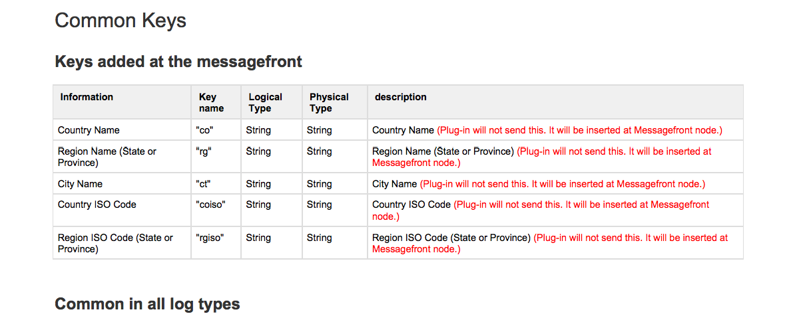
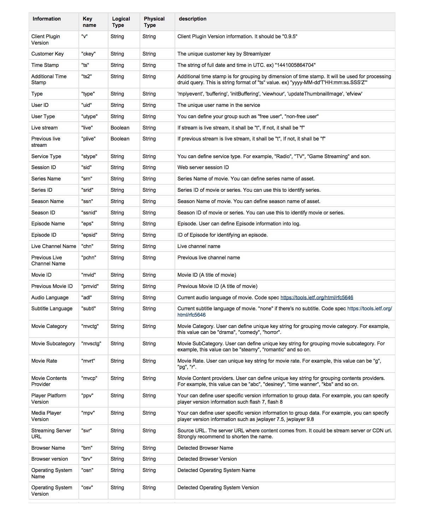
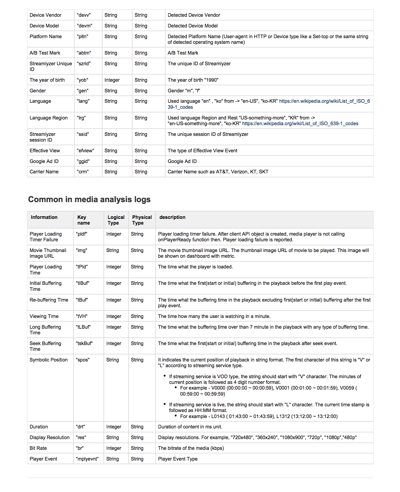
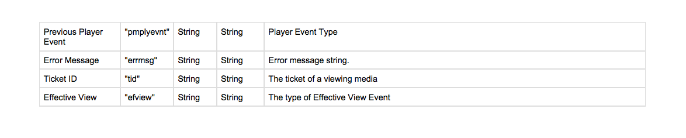

Include your answers to this morning's exercises in `answers.py` or `answers.ipynb`

## Part 1: Access to the data

S3 is the storage system on AWS. Here, you will interact with it to take this test.
The file name you need to connect and download is `interview_data` in this S3 bucket. Use any library/package to read the file from S3.
I recommend using the library `boto` if you planned to do it with `Python`.

**NOTE: IF YOU CANNOT CONNECT TO OR DOWNLOAD THE DATA FROM AWS S3 BUCKET,
USE THIS DATA** [_'interview data'_](https://drive.google.com/open?id=0B5rOf6SBB06BaG9fNkQzRmowQ3M) **INSTEAD**

 

## Part 2: Understand the data

The streamlyzer lets on-line video service providers measures viewers' experiences in real-time with their assets across various devices and environments. The Streamlyzer allows them to have new insight and tune their performance of their streaming service. The message front is the
distributed message processing components of Streamlyzer.

Here's a brief description of the variables including:

   
   
      
   
 

1. Load the data

  - From now on, we'll focus on a customer '17943e6c6eec49cdb6'. Remove all other customers for following analysis. (__Hint :__ 'ckey')

    **Q1:**
    - How many logs are there with this customer?
    - How many log types are there? (__Hint :__ 'type') and what are they?

2. Drop the rows with 'tid' which do not have a specified user (__Hint :__'uid') from the data.

    **Q2:**
    - How many users are there? ...(1)
    - How many users viewed only one video (__Hint :__'tid') ? ...(2)
    - How many users viewed more than one videos (__Hint :__'tid') ? ...(3)
    - For a sanity check, (1) == (2)+(3)?

3. Draw a table such as follows.
    - You'll only need ['uid','tid','tBuf','tIBuf','tLBuf','tPld','tVH','type','mplyevnt'] columns from now on. Columns related to *time* are continuous variables, while others are categorical variables

    - For the *time* variables, such as tVH, you'll need to **sum** them to get the total time. For example, for uid X and tid 1, there can be more than one viewing time log (during watching a video) for this uid X and tid 1. In this case, summing up time variables within same uid and tid will give you the total time, which is presented in table below. For example, how long were the viewing time for uid X for tid 1 can be calculated
     (__Hint :__ groupby to the rescue)

    - For the *categorical* variables, you'll need to **count** how many times each category appeared in the logs. For example, how many times bitrate change occurred can be calculated

    - Result would looks like this

      | uid   | tid   | Viewing time('tVH') | ... | Bitrate change('brchg') | ... |
      |-------|-------|---------------------|-----|-------------------------|-----|
      | uid X | tid 1 | 120000              | ... | 4                       | ... |
      | uid X | tid 2 | 0                   | ... | 0                       | ... |
      | uid X | tid 3 | 50000               | ... | 0                       | ... |
      | uid Y | tid 4 | 2532300             | ... | 1200                    | ... |
      | uid Y | tid 5 | 5000                | ... | 0                       | ... |
      | ...   | ...   | ...                 | ... | ...                     | ... |

 
## Part 3: Descriptive statistics

Often times, we are interested in the summary statistics of our data.

1. From the table above (Part1.3), find mean value, standard deviation, minimum value, maximum value for each column
    - Describe the meaning of what you've calculated. For example, what does the mean value of 'some number' for viewing time represent?

2. Plot histogram for each column

3. Draw one more table such as follows
    - You'll use 'uid','tid','tBuf','tIBuf','tLBuf','tPld','tVH','type','mplyevnt' columns again. Columns related to *time* are continuous variables, while others are categorical variables. Please refer to the table below. Note that 'tid' has gone

    - Find mean value, standard deviation, minimum value, maximum value for each column.

    - Describe the meaning of what you've calculated. For example, what does the mean value of 'some number' for viewing time represent?

    - Result would looks like this

        | uid   | Viewing time('tVH') | ... | ... | Bitrate change('brchg') | ... |
        |-------|---------------------|-----|-----|-------------------------|-----|
        | uid X | 34560000            | ... | ... | 40                      | ... |
        | uid Y | 937400              | ... | ... | 100                     | ... |
        | uid Z | 17470000            | ... | ... | 20340                   | ... |
        | uid M | 34985000            | ... | ... | 120000                  | ... |
        | uid N | 5000                | ... | ... | 0                       | ... |
        | ...   | ...                 | ... | ... | ...                     | ... |

_4. Find the user who has maximum viewing time (i.e. the length of the viewing time). How long did the user watched? 'tVH' is in milliseconds, how long the viewing time in hour?

_5. Also find the user who watched most videos in terms of 'tid' (i.e. the number of videos). How many videos did the user watched?

_6. Plot histogram for each column
